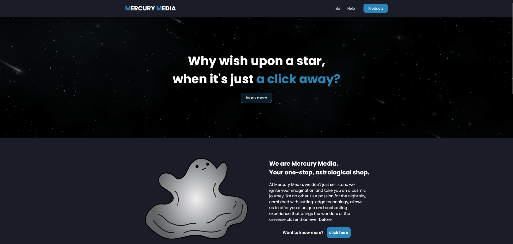
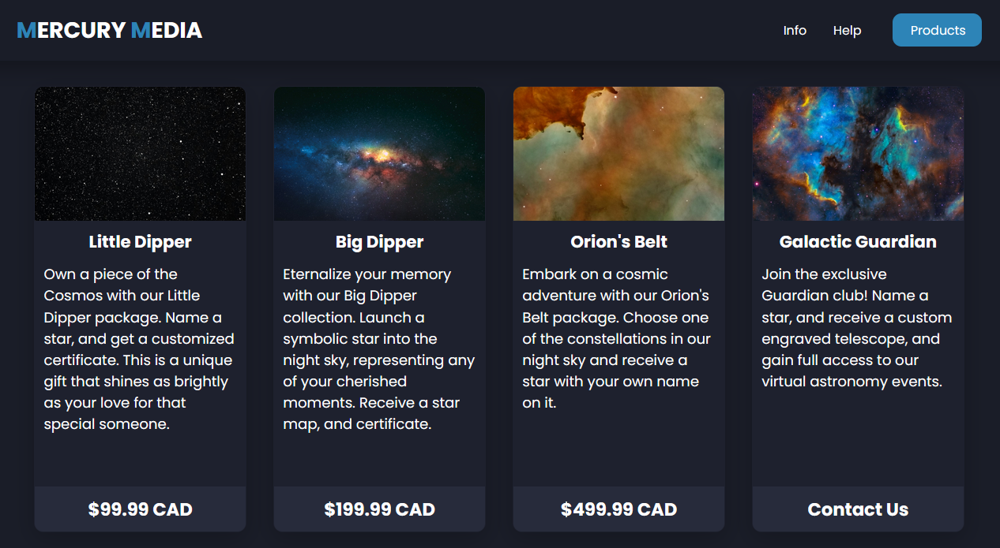

# Assignment 4, in Markdown

For the final project in the 'Intro to Web Development' course at MITT, my class was tasked with making many *semi-functional* web pages for fictional companies. Some groups chose to make knock-off versions of popular brands, and some made completely new companies from scratch. My group chose the latter.

## Enter Mercury Media

Mercury Media is a fictional company that specializes in the selling of stars, and constellations. The site serves as a hub for consumers to learn about the company, purchase products, and contact the company if any troubles arrise. We designed this company to appeal to a wide variety of people, but mainly those interested or intrigued by space itself. This can range from small children, to the elderly, all are welcome!

My group knew from the get go that we wanted to attempt to make a dark site, as we knew that would help us to stand out; regardless of it that 'standing out' was good or bad. In the end, it worked! But, it took extra steps in terms of color theory to get to that point, as we had multiple color palettes throughout the design process, and had only finalized it within the last days of the project.

For now, we will focus on the index page as that was designed by yours truly!



## Common Struggles

Some of the struggles I faced throughout my development process were:

- Simple structuring issues within HTML
- Alignment issues within CSS
- Images and videos not appearing, or adjusting to their correct orientations
- Incorrect down-sizing for smaller viewer screens

and so... so much more.

Regardless of struggles and hardship, its always very fun to learn about new things that you have never come across, for example:

The following image shows what my product section of my page looks like:



The struggle with this section was compiling all of the elements you see into 1 box, 4 times over. As all the different images needed to be individually styled, and all of the elements within the boxes had to be tweaked to fit into their respective boxes, all at multiple different screen sizes. The explanation I have provided doesn't come close to providing the level of confused googling and the handful of late nights spent scouring forums and using ChatGPT, just to get that section to function properly!

Here are some examples from what I just stated:

```css
/*
  Using CSS, I learned how to style individual corners of images!
*/

.image-1,
.image-2,
.image-3,
.image-4 {
    border-top-right-radius: 9px;
    border-top-left-radius: 9px; 
}

/*
  This code adds the curved corners to the top right, and left of the space images you see within the product section.
*/
```

Branching out, and doing my own research into what is appealing to me as an aspiring web developer has been an interesting journey in itself. Being able to learn things I never thought I'd be able to comprehend, and putting them to use properly is a feeling you don't receive very often. A prime example of this is...

```css
/*
  Seen in this code! The 'down-sizing' aspect of my page took me many days to get just right. And, it took up a large majority of my time for this project.
  It was something I saw I was struggling with, and outsourced information to make it as good as I possibly could; from both a professional in the field, and
  good ol' robots.
*/

/*
  Here is a sample of code to show what I mean
*/

@media screen and (max-width: 1200px) {
    
    header {
        height: 68px;
    }

    .head h2 {
        font-size: 24px;
        line-height: 68px;
    }

    h1 {
        font-size: 40px;
    }

    h2 {
        font-size: 20px;
    }

    h3 {
        font-size: 16px;
    }

    h4 {
        font-size: 18px;
    }

    ...
}

/*
  Although confusing, the bare bones of this section change the sizes of font that are displayed based on a user's screen size.
  In this case, the page's major aspects begin to shrink when the page hits 1200 pixels in width. This can be, and is commonly applied for other
  screen sizes as well! 
  
  See the following resolutions:
*/

/* 920 pixels in width */
@media screen and (max-width: 920px) {}

/* 800 pixels in width */
@media screen and (max-width: 800px) {}

/* 540 pixels in width */
@media screen and (max-width: 540px) {}
```

## Possible Improvements

As with most things in life, improvements are to be made! This stands true for my webpage as well.

A major aspect that is to be improved upon is a lot of little things, combined into a 'big thing' within the scope of the page itself.

Here is an example of what I mean:

```css
/* 
  There are many inconsistencies that lead my code to look messy, and convoluted.

  Whether it be empty strings...
*/

/* Empty / unnecessary overflow element, which hides aspect of the element in question when sizes of the page are changed */
footer {
    background-color: #11131a;
    overflow: ;
    color: #fff;
    height: 80px;
}

/* Or simple 'border-radius' (rounded corner) inconsistencies */
.one, .two, .three, .four {
        ...
    border-radius: 11px;
        ...
}
button.learn-more {
        ...
    border-radius: 10px;
        ...
}
/* 
  Mere pixels may not seem like much. But, they mean a lot more in terms of consistency, and readability 
  rather than looks itself.
*/
```
Although my page came together in a coherent manor, many mistakes and bad practices are admittedly there, which is a natural part of design!

It takes hard work and dedication to persevere through bad things. But, in the end, good is always bound to come, and your seeds that you sow along the way are bound to provide beautiful fruit one day, all it takes is a bit of patience.

In short? trust the process! Things will work, as well as not. But the only constant is the person who is dead set on fixing it. And that too, can be you!